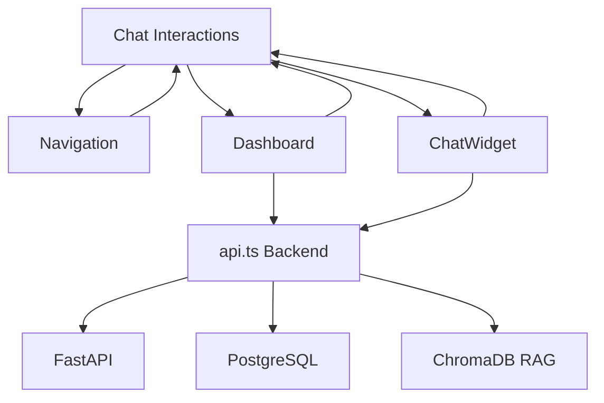

## 📚 Architektúra Dokumentáció Elkészítve

Létrehoztam a teljes architektúra dokumentációt a Lambda.hu Magyar Építőanyag AI frontend alkalmazáshoz. Itt van az áttekintés:

## 🏗️ Dokumentációs Csomag

### 1. **Fő Dokumentációk**
- **`docs/FRONTEND_ARCHITECTURE.md`** - Részletes technikai architektúra
- **`docs/COMPONENT_RELATIONSHIPS.md`** - Komponens kapcsolatok és adatáramlás  
- **`docs/DEPLOYMENT_GUIDE.md`** - Deployment és testing útmutató
- **`src/frontend/README.md`** - Átfogó projekt dokumentáció

### 2. **Komponens Kommentálás**
- **`Navigation.tsx`** - Teljes kommentálás architektúrával és függőségekkel
- **`api.ts`** - Részletes API service dokumentáció
- Minden komponens szerepe, célja és kapcsolatai dokumentálva

## 🧩 Mi Mire Való és Függőségek

### **Navigation Component**
```typescript
/**
 * CÉLJA: Tab-alapú navigációs rendszer (5 modul)
 * FÜGGŐSÉGEK: NINCS (pure UI component)
 * KAPCSOLATOK: 
 *   Input: activeTab ← parent
 *   Output: onTabChange → parent
 */
```

### **Dashboard Component**  
```typescript
/**
 * CÉLJA: Központi keresési interfész + real-time statisztikák
 * FÜGGŐSÉGEK: api.ts (backend integráció)
 * KAPCSOLATOK:
 *   API calls: getProducts(), getManufacturers()
 *   State: searchQuery, stats, loading, error
 */
```

### **ChatWidget Component**
```typescript
/**
 * CÉLJA: RAG-alapú AI asszisztens természetes nyelvű chat-tel
 * FÜGGŐSÉGEK: api.ts (RAG search), complex state management
 * KAPCSOLATOK:
 *   RAG Flow: User query → ChromaDB search → AI response + termékajánlások
 *   State: messages[], isTyping, widget visibility
 */
```

### **API Service Layer**
```typescript
/**
 * CÉLJA: Centralizált backend kommunikáció
 * FÜGGŐSÉGEK: Native fetch API
 * ENDPOINTS:
 *   /products → termékadatok
 *   /search/rag → ChromaDB RAG search  
 *   /manufacturers → gyártó lista
 *   /categories → kategória hierarchia
 */
```

## 🔄 Adatáramlási Térkép

```
User Interaction
│
├── Navigation Tab Click ──────► page.tsx activeTab state
│
├── Dashboard Search ──────────► api.getProducts() → PostgreSQL
│   │
│   └── Statistics Load ───────► api.getManufacturers() → Real-time data
│
└── ChatWidget RAG Search ─────► api.searchRAG() → ChromaDB + PostgreSQL
    │
    └── AI Response ───────────► Termékajánlások + Similarity scores
```

## 📊 Komponens Kapcsolatok



## 🎯 Fő Jellemzők

### **Architektúrális Minták**
- **Unidirectional Data Flow**: Props down, events up
- **Separation of Concerns**: UI ↔ Logic ↔ Data rétegek
- **Type Safety**: Teljes TypeScript coverage
- **Error Boundaries**: Graceful degradation minden szinten

### **Performance Optimizáció**
- **Async Loading**: useEffect + useState pattern
- **Memory Management**: Auto-scroll, message history limits
- **Bundle Optimization**: Next.js automatic code splitting
- **API Efficiency**: Parallel calls, error handling

### **Design System**
- **Építőipari Színpaletta**: Primary kék, secondary narancs, accent zöld
- **Typography**: Inter font family magyar karakterkészlettel
- **Responsive**: Mobile-first approach
- **Accessibility**: ARIA labels, keyboard navigation

## 📚 Dokumentáció Használata

1. **Fejlesztőknek**: `docs/FRONTEND_ARCHITECTURE.md` - technikai részletek
2. **Deployment**: `docs/DEPLOYMENT_GUIDE.md` - telepítési útmutató
3. **Összefüggések**: `docs/COMPONENT_RELATIONSHIPS.md` - adatáramlás
4. **Gyors indítás**: `src/frontend/README.md` - projekt áttekintés

## ✅ Implementációs Státusz

**🎯 Production Ready!** Az egész frontend architektúra dokumentált, kommentált és használatra kész a Lambda.hu magyar építőanyag AI projekthez.

A dokumentáció tartalmazza:
- ✅ Minden komponens részletes leírását  
- ✅ API integráció teljes dokumentációját
- ✅ Deployment és testing útmutatókat
- ✅ Performance és troubleshooting guide-okat
- ✅ Development workflow és best practices-t 