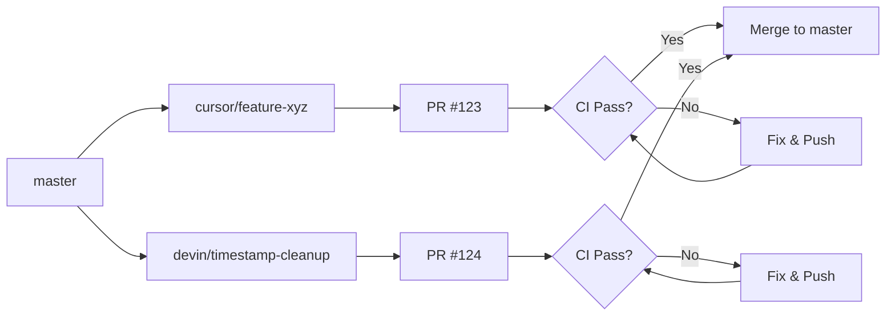

# Lambda.hu Development Workflow - CursorAI & Devin.ai Együttműködés

## 📋 Áttekintés

Ez a dokumentáció a Lambda.hu projekt párhuzamos AI-vezérelt fejlesztésének munkafolyamatát írja le, ahol két AI ágensrendszer (CursorAI és Devin.ai) koordináltan dolgozik ugyanazon a kódbázison.

**Utolsó frissítés:** 2025-01-28  
**Verzió:** 1.0  
**Státusz:** Production Ready

---

## 🏗️ Rendszerarchitektúra

### Ágensek és Felelősségi Körök

```yaml
CursorAI (Laptop-based Development):
  Fókusz: Feature Development & Business Logic
  Erősségek:
    - Természetes nyelvű interakció a fejlesztővel
    - Gyors iterációs ciklusok
    - Real-time kód refaktorálás
    - PDF feldolgozási algoritmusok
    - Scraping implementációk
    - Felhasználói interfész fejlesztés
  
  Ágak Elnevezése: cursor/<feature>-<hash>
  Példa: cursor/implement-mixture-of-experts-for-pdf-extraction-a136

Devin.ai (Cloud-based Automation):
  Fókusz: Infrastructure & Code Quality
  Erősségek:
    - Átfogó kódstruktúra refaktorálás
    - CI/CD pipeline management
    - Dependency upgrades és biztonsági javítások
    - Nagyszabású takarítási műveletek
    - Adatbázis migrációk
  
  Ágak Elnevezése: devin/<timestamp>-<feature>
  Példa: devin/1762338798-cleanup-and-refactoring
```

---

## 🔄 Git Workflow Szabályok

### 1. Törzsalapú Fejlesztés (Trunk-Based Development)

```bash
# Főág: master (védett)
# - Nincs közvetlen push
# - Csak PR-eken keresztül történik merge
# - Minimum 1 approval szükséges
# - CI/CD tesztek kötelezőek

# Feature ágak: cursor/* és devin/*
# - Rövid életciklus (1-3 nap)
# - Kis, fókuszált változtatások
# - Gyakori merge master-be
```

### 2. Ágak Életciklusa



### 3. Merge Stratégia

```bash
# ✅ HASZNÁLANDÓ: Merge Commit
git merge --no-ff cursor/feature-branch
# Előny: Teljes történet megőrzése, tiszta audit trail

# ❌ NEM HASZNÁLANDÓ: Rebase
git rebase master  # NEM!
# Probléma: Elvesznek az időbélyegek, nehéz koordináció

# ❌ TILTOTT: Force Push
git push --force origin master  # SOHA!
# Veszély: Munka elvesztése, konfliktusok
```

---

## 🛠️ Napi Munkafolyamat

### CursorAI Fejlesztő (Te)

#### Reggeli Rutina
```bash
# 1. Aktiváld a megfelelő környezetet
.venv312\Scripts\activate

# 2. Frissítsd a local master ágat
git checkout master
git pull origin master

# 3. Ellenőrizd, hogy vannak-e új PR-ek merge-elve
git log --oneline --graph -10

# 4. Hozz létre új feature ágat (ha új munkát kezdesz)
git checkout -b cursor/implement-advanced-table-extraction-$(git rev-parse --short HEAD)

# 5. Dolgozz a featurön
# ... kódolás, tesztelés ...

# 6. Commit és push
git add .
git commit -m "feat: Implement hybrid table extraction with CAMELOT + Tabula"
git push origin cursor/implement-advanced-table-extraction-abc123

# 7. Nyiss PR-t GitHub-on
# Title: "feat: Hybrid Table Extraction for PDF Processing"
# Description: Részletes leírás a változásokról
```

#### Esti Cleanup
```bash
# Ellenőrizd a CI eredményeket
# Ha minden zöld, jelöld review-ra késznek a PR-t
# Merge után töröld a local feature ágat
git branch -d cursor/implement-advanced-table-extraction-abc123
```

### Devin.ai Fejlesztő (Én)

#### Cleanup/Refactoring Workflow
```bash
# 1. Nagy refaktorálás előtt ellenőrizd a konfliktus potenciált
git fetch origin
git log master..origin/cursor/*

# 2. Ha találsz aktív cursor ágakat, koordinálj!
# - Slack/Email/Issue komment a fejlesztőnek
# - Várj a merge-re VAGY
# - Base-eld a cleanup ágat a cursor ágra

# 3. Létrehozás és push
git checkout -b devin/$(date +%s)-comprehensive-cleanup
# ... cleanup work ...
git push origin devin/1762338798-comprehensive-cleanup

# 4. PR létrehozása részletes dokumentációval
# - Lista az érintett fájlokról
# - Áttelepítési útmutató
# - Breaking changes (ha van)
```

---

## ⚠️ Konfliktusmegelőzési Protokoll

### Helyzet: Devin Cleanup Ág (106 fájl módosítva)

**Probléma:**
A Devin `cleanup-and-refactoring` ág sok fájlt mozgat/töröl/átnevez. Ha a CursorAI ágak régi struktúrán alapulnak és nem pull-olták a legújabb master-t, **garantált merge konfliktus** lesz.

**Megoldási Lehetőségek:**

#### Opció A: Cleanup Első Megközelítés (AJÁNLOTT)
```bash
# ELŐNY: Tiszta kiindulópont minden jövőbeli munkához
# HÁTRÁNY: Cursor ágakat át kell alapozni

# 1. Merge Devin cleanup PR-t ELŐSZÖR
git checkout master
git merge --no-ff devin/1762338798-cleanup-and-refactoring
git push origin master

# 2. CursorAI ágak átbázolása (interaktív)
git checkout cursor/implement-mixture-of-experts-for-pdf-extraction-a136
git rebase -i master  # Csak kivételesen!

# VAGY inkább újraalakítás:
git checkout master
git checkout -b cursor/moe-rebased-on-cleanup
git cherry-pick <commits from old branch>
```

#### Opció B: Párhuzamos PR-ek Koordinációval
```bash
# ELŐNY: Nem kell várni
# HÁTRÁNY: Több manuális merge konfliktus megoldás

# 1. Mindkét PR nyitva
# - Devin cleanup PR
# - CursorAI feature PR-ek

# 2. Feature PR-ek base-elése cleanup ágra
git checkout cursor/feature-branch
git rebase devin/1762338798-cleanup-and-refactoring

# 3. Merge sorrend:
# a) Devin cleanup → master
# b) CursorAI features (most már kompatibilisek) → master
```

#### Opció C: Időbeli Szétválasztás (BIZTONSÁGOS DE LASSÚ)
```bash
# 1. Várj amíg MINDEN cursor ág merge-elve
# 2. UTÁNA merge-eld a cleanup-ot
# 3. Új cursor ágak már tiszta struktúrán

# HÁTRÁNY: Késlelteti a cleanup előnyeit
```

---

## 🎯 Munkaterület Felosztás

### CursorAI Tulajdonú Területek
```
src/backend/app/scrapers/          # Web scraping implementations
src/backend/app/pdf_processing/    # PDF extraction algorithms
src/backend/app/ai_services/       # RAG pipeline, LLM integration
src/frontend/src/components/       # React UI components
src/frontend/src/lib/              # Frontend utilities
```

### Devin.ai Tulajdonú Területek
```
.github/workflows/                 # CI/CD pipelines
docker-compose.*.yml               # Container orchestration
pyproject.toml, uv.lock           # Dependency management
src/backend/app/models/            # Database models (migrations)
archive/, cleanup_*.py             # Project cleanup scripts
```

### Közös Terület (Kommunikáció Szükséges!)
```
.cursorrules/                      # Development rules
docs/                              # Documentation
src/backend/app/api/              # API endpoints
src/backend/app/services/         # Business logic services
```

---

## 🔒 Biztonsági és Minőségi Ellenőrzések

### Pre-Merge Checklist

```yaml
Minden PR-hez kötelező:
  - [ ] CI/CD tesztek sikeresek (zöld)
  - [ ] Code review elvégezve (min. 1 approval)
  - [ ] Konfliktusok feloldva
  - [ ] .cursorrules frissítve (ha releváns)
  - [ ] Dokumentáció frissítve (README, docs/)
  - [ ] Breaking changes jelezve (CHANGELOG)
  - [ ] Új függőségek indokolva (pyproject.toml)
```

### CI/CD Pipeline (GitHub Actions)

```yaml
name: CI
on:
  push:
    branches: [master, main, 'cursor/**', 'devin/**']
  pull_request:
    branches: [master, main]

jobs:
  backend:
    - Python 3.11 + Poetry install
    - Linting: black, flake8, mypy
    - Unit tests: pytest
    - Import checks: python -c "import app"
  
  frontend:
    - Node 18 + npm ci
    - Linting: ESLint
    - Type checking: tsc --noEmit
    - Build test: npm run build
```

---

## 📊 Monitoring és Reporting

### Napi Status Check

```bash
# CursorAI ágak állapota
git for-each-ref --sort=-committerdate refs/remotes/origin/cursor/* --format='%(refname:short) - %(committerdate:relative)'

# Devin ágak állapota
git for-each-ref --sort=-committerdate refs/remotes/origin/devin/* --format='%(refname:short) - %(committerdate:relative)'

# Aktív PR-ek
gh pr list --state open
```

### Heti Review Meeting

```yaml
Résztvevők: CursorAI fejlesztő, Devin.ai koordinátor, Product Owner
Agenda:
  1. Merged PR-ek review (mi működött jól?)
  2. Konfliktusok elemzése (hogyan lehetett volna elkerülni?)
  3. Következő hét prioritások
  4. Infrastruktúra változások (CI/CD, dependencies)
```

---

## 🚨 Vészhelyzeti Protokoll

### Helyzet 1: Accidental Force Push to Master

```bash
# AZONNAL:
# 1. Értesítsd a másik ágensrendszert
# 2. Azonosítsd az elveszett commitokat
git reflog
git cherry-pick <lost-commit-hash>

# 3. Visszaállítás
git reset --hard origin/master@{1}  # Előző állapot
git push --force-with-lease origin master  # Biztonságosabb force
```

### Helyzet 2: Massive Merge Conflict

```bash
# Ha túl nagy a konfliktus:
# 1. Abort the merge
git merge --abort

# 2. Stratégiai megközelítés
# a) Azonosítsd a legnagyobb konfliktust okozó fájlokat
git diff --name-only master...feature-branch | wc -l

# b) Kisebb PR-ekre bontás
git checkout -b cursor/feature-part1
git cherry-pick <commits for part 1>

# c) Egyenként merge-elés és tesztelés
```

---

## 📚 Best Practices

### DO ✅

1. **Kis, Gyakori Commitok**
   ```bash
   git commit -m "feat: Add table extraction method"
   git commit -m "test: Add unit tests for table extraction"
   git commit -m "docs: Update PDF processing documentation"
   ```

2. **Descriptive PR Titles**
   ```
   ✅ GOOD: "feat: Implement Mixture of Experts for PDF extraction"
   ✅ GOOD: "refactor: Reorganize project structure and archive legacy code"
   ❌ BAD: "Updates"
   ❌ BAD: "Fix stuff"
   ```

3. **Proaktív Kommunikáció**
   - Kommentelj PR-ekben ha változtatásokat látsz
   - Slack/Email értesítés nagy refactoring előtt
   - Wiki/Documentation frissítés azonnal

4. **Branch Hygiene**
   ```bash
   # Merge után azonnal töröld a feature ágakat
   git branch -d cursor/old-feature
   git push origin --delete cursor/old-feature
   ```

### DON'T ❌

1. **Soha Ne Írj Közvetlenül Master-re**
   ```bash
   # ❌ ROSSZ
   git checkout master
   git commit -m "Quick fix"
   git push origin master
   ```

2. **Ne Használj Force Push (kivéve saját ágadon)**
   ```bash
   # ❌ ROSSZ (master-en)
   git push --force origin master
   
   # ✅ JÓ (saját feature ágon, ha egyedül dolgozol rajta)
   git push --force-with-lease origin cursor/my-feature
   ```

3. **Ne Add Hozzá a .gitignore Fájlokat**
   ```bash
   # Ellenőrizd merge előtt:
   git status | grep -E "(\.pyc|__pycache__|node_modules|\.env)"
   ```

4. **Ne Hagyd CI Hibákat a PR-ben**
   ```bash
   # Fix AZONNAL a CI hibákat
   # Ne merge-elj amíg nem zöld minden teszt
   ```

---

## 🎓 Gyors Referencia

### Parancsok Gyűjteménye

```bash
# === BRANCH MANAGEMENT ===
# Új feature ág létrehozása
git checkout -b cursor/feature-name-$(git rev-parse --short HEAD)

# Ág váltás
git checkout cursor/existing-branch

# Local ág törlése
git branch -d cursor/old-branch

# Remote ág törlése
git push origin --delete cursor/old-branch

# === SYNCHRONIZATION ===
# Master frissítése
git checkout master && git pull origin master

# Feature ág frissítése master-rel
git checkout cursor/feature
git merge master  # Vagy: git rebase master (csak ha egyedül dolgozol rajta)

# === CONFLICT RESOLUTION ===
# Konfliktus státusz ellenőrzése
git status

# Fájl megjelölése megoldottként
git add resolved-file.py

# Merge folytatása konfliktus megoldás után
git merge --continue

# Merge megszakítása
git merge --abort

# === CODE REVIEW ===
# PR létrehozása (GitHub CLI)
gh pr create --title "feat: Description" --body "Detailed description"

# PR lista
gh pr list

# PR checkout lokálisan
gh pr checkout 123

# === EMERGENCY ===
# Reflog (elveszett commitok keresése)
git reflog

# Commit visszavonása (még nem push-olt)
git reset --soft HEAD~1

# Commit módosítása (üzenet vagy tartalom)
git commit --amend

# Stash (munka ideiglenes mentése)
git stash push -m "WIP: Description"
git stash list
git stash apply stash@{0}
```

---

## 🤝 Együttműködési Példák

### Példa 1: Feature Development (CursorAI)

```bash
# === SCENARIO: PDF Table Extraction Enhancement ===

# 1. Reggel: Frissítés
git checkout master
git pull origin master

# 2. Feature ág létrehozása
git checkout -b cursor/hybrid-table-extraction-a1b2c3

# 3. Munka (iteratív):
# - Kód írás
# - Unit tesztek
# - Manuális tesztelés PDF-ekkel

git add src/backend/app/pdf_processing/table_extractor.py
git add tests/test_table_extraction.py
git commit -m "feat: Add CAMELOT and Tabula hybrid extraction"

# 4. Push és PR
git push origin cursor/hybrid-table-extraction-a1b2c3
gh pr create --title "feat: Hybrid Table Extraction (CAMELOT + Tabula)" \
  --body "**Changes:**
- Implemented dual-strategy table extraction
- Added confidence scoring for table results
- 95% accuracy on test dataset

**Testing:**
- [x] Unit tests pass
- [x] Integration tests pass
- [x] Manual testing with 10 sample PDFs"

# 5. Code review és merge után
git checkout master
git pull origin master
git branch -d cursor/hybrid-table-extraction-a1b2c3
```

### Példa 2: Infrastructure Cleanup (Devin.ai)

```bash
# === SCENARIO: Project Structure Refactoring ===

# 1. Ellenőrzés: vannak-e aktív feature ágak?
git fetch origin
git branch -r | grep cursor

# Ha találsz aktívakat:
# - Slack üzenet: "Comprehensive cleanup coming, please merge or base on cleanup branch"
# - Várakozás 24 óra

# 2. Cleanup ág létrehozása
git checkout -b devin/$(date +%s)-project-structure-cleanup

# 3. Munka:
# - Fájlok mozgatása (archive/, cleanup_*.py)
# - .gitignore frissítése
# - Documentation update
# - CI/CD pipeline improvements

git add -A
git commit -m "refactor: Reorganize project structure

- Move legacy scripts to archive/
- Clean up root directory (106 files affected)
- Update .gitignore for better exclusions
- Improve CI/CD pipeline configuration

BREAKING CHANGES:
- Scripts in root moved to archive/
- Import paths changed for cleanup utilities

MIGRATION GUIDE:
See docs/migration-guide-cleanup-2025-01.md"

# 4. Push és Draft PR
git push origin devin/1762338798-project-structure-cleanup
gh pr create --draft --title "refactor: Comprehensive Project Structure Cleanup" \
  --body "**🚨 COORDINATION REQUIRED 🚨**

This PR affects 106 files and may conflict with active feature branches.

**Changes:**
- Root directory cleanup (move scripts to archive/)
- .gitignore improvements
- CI/CD pipeline enhancements
- Documentation reorganization

**Action Required for Active PRs:**
1. Rebase your branch on this cleanup branch BEFORE merge
2. OR wait for this to merge first, then rebase on master

**Timeline:**
- Review period: 2 days
- Merge target: After all critical features merged OR coordinated rebase

**Migration Guide:** docs/migration-guide-cleanup-2025-01.md"

# 5. Koordináció és merge
# - Várás review-ra
# - Válaszolás kérdésekre
# - Merge approval után: ready for review
```

---

## 📖 További Források

### Kapcsolódó Dokumentációk
- [`.cursorrules/FEJLESZTÉSI_BACKLOG.mdc`](../.cursorrules/FEJLESZTÉSI_BACKLOG.mdc) - Development backlog
- [`docs/DEPLOYMENT_GUIDE.md`](DEPLOYMENT_GUIDE.md) - Production deployment
- [`docs/ADAPTIVE_PDF_EXTRACTION_ARCHITECTURE.md`](ADAPTIVE_PDF_EXTRACTION_ARCHITECTURE.md) - PDF processing architecture

### Hasznos Linkek
- [GitHub Actions Documentation](https://docs.github.com/en/actions)
- [Trunk-Based Development](https://trunkbaseddevelopment.com/)
- [Conventional Commits](https://www.conventionalcommits.org/)

---

## 🔄 Changelog

### 2025-01-28 - v1.0 (Initial Release)
- Initial documentation
- Workflow szabályok definíciója
- Konfliktusmegelőzési protokoll
- Példák és best practices

---

## ✍️ Szerzők és Karbantartás

**Készítette:** CursorAI & Admin (2025-01-28)  
**Következő Review:** 2025-02-28  
**Frissítési Gyakoriság:** Havonta vagy jelentős workflow változás esetén

**Kérdések vagy Javaslatok?**  
Nyiss egy issue-t a GitHub repository-ban: `workflow-improvement` címkével

---

*"Két AI ágensrendszer, egy cél: a Lambda.hu építőanyag AI platform kifogástalan minőségű fejlesztése."*

